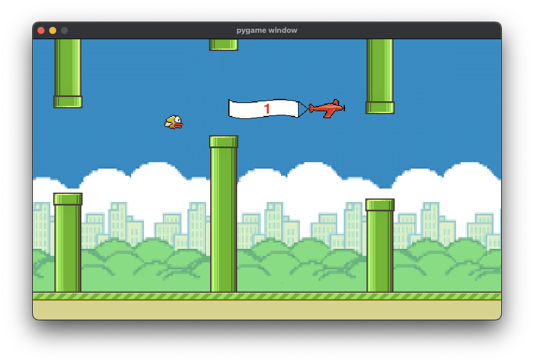
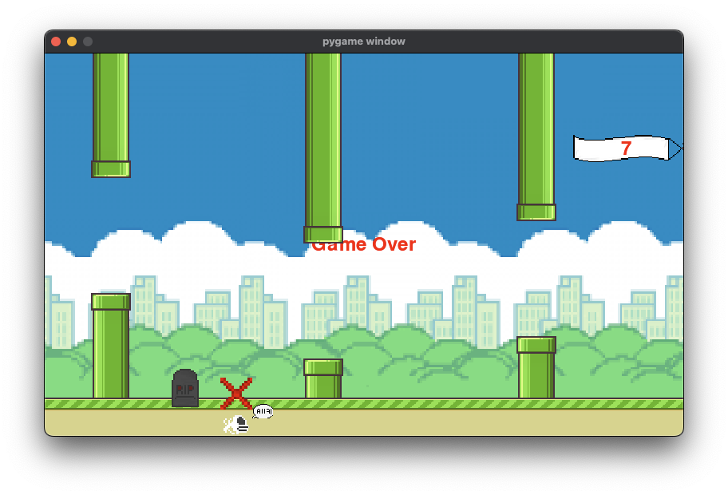

# FlapPYbird project

This is a small python game built with pygame for fun. I programmed it back in the day in the school breaks 2019 to learn programming. It's based on the popular small minigame called FlappyBird, which was shortly available in the Apple Appstore and copied by many developers. Now its my turn xD. It has many bugs though and as I am knowing Python better now, I realize how crappy it's written. I tried to fix some bugs but I think the code has to be written entirely from the beginning again.

You just need to install `python`, `pygame` and run the game from its directory to properly load all the files.

(`flappybirdOld.py` file)

## Update April 24th 2024:

(`flappybird.py` file)

- Basically rewritten the entire script to my current knowledge (I want to apply reinforcement learning to automatically play the game)
- Removed some features for easier handling
- Used poetry for management

## How to run:

1. Install `poetry` with `pipx`
2. Install python dependencies: `poetry install`
3. Run game
    a. `poetry run python flappybird.py` for old version
    a. `poetry run python flappybirdOld.py`